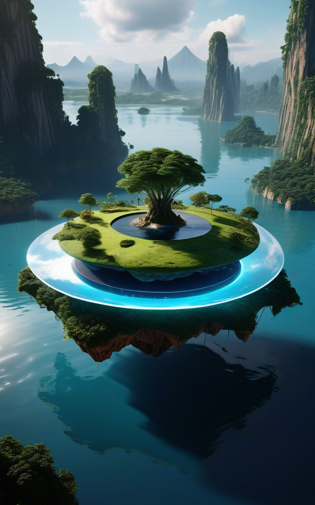

# AetherWorld: The Floating Islands & The Mystery of the Twelve Golden Flowers

## A Realm Beyond the Veil of Reality

In the ethereal expanse above the clouds, where the boundaries between reality and fantasy blur, lies a realm of unparalleled wonder—the Floating Islands. Here, gravity bends to the will of the Æther, a mystical force that weaves through the fabric of the universe. The islands, suspended by the very threads of the cosmos, are a testament to the harmonious dance of technology and nature.

## The Floating Islands

These floating wonders are not mere landmasses but living, breathing entities, each a masterpiece of sacred geometry. The structures and gardens are meticulously aligned with the golden ratio (φ ≈ 1.618034), creating an environment that nurtures the body, mind, and spirit in perfect harmony. The air is filled with the whispers of ancient secrets, and the ground pulses with the rhythm of the universe.

## The Guardians of the Celestial Order

In this enchanted realm, twelve extraordinary sisters serve as the guardians of the celestial order. Each sister wields unique powers and deep wisdom, ensuring the harmony and prosperity of their celestial home. They are the keepers of the Æther, the weavers of time, and the healers of souls. Their presence is a beacon of light and guidance, illuminating the path for those who seek to uncover the mysteries of the Floating Islands.

### The Ethereal Expanse

- **Sky Above the Clouds**: The sky is a canvas painted with the hues of dawn and dusk. The islands drift lazily, their shadows casting patterns of light and darkness on the landscape below.
- **Scent and Sound**: The air is filled with the scent of blooming flowers and the sound of gentle breezes. Here, the boundaries between the physical and the ethereal blur, and the impossible becomes possible.

### The Threads of the Æther

- **Mystical Substance and Force**: The Æther is the lifeblood of the islands, connecting them to the cosmos and imbuing them with a unique energy.
- **Balance of Nature and Technology**: The sisters, with their deep connection to the Æther, maintain the delicate balance of nature and technology. From the gentle glow of light to the whispering winds, from the vibrant gardens to the melodic sounds, each sister plays a vital role in the island's ecosystem.

### The Harmony of the Cosmos

- **Sacred Geometry**: The islands are masterpieces of sacred geometry, each structure and garden carefully aligned with the golden ratio to create perfect harmony with the cosmic order.
- **Nurturing Environment**: The gardens are living tapestries of beauty and function, the water systems are innovative and sustainable, and the technologies are advanced yet harmonious with nature.

### The Mysteries Await

As you step into this enchanted realm, the mysteries of the Floating Islands and the Twelve Golden Flowers will unfold before you. The sisters, with their unique abilities and deep wisdom, will guide you through the complexities of this magical world. Each island holds secrets waiting to be discovered, and each sister has a story to tell.

### The Call of the Unknown

Are you ready to embark on a journey beyond the veil of reality? To explore the Floating Islands and uncover the mysteries of the Twelve Golden Flowers? The path is illuminated, and the gates are open. Step into the unknown, and let the wonders of the Floating Islands captivate your imagination.
